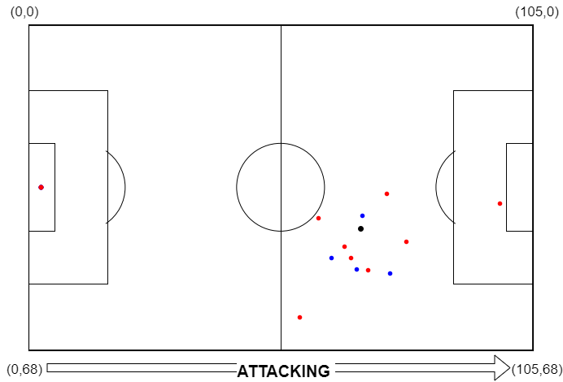

United and Integrated Event Data (UEID)
====================================================================

The UEID is an origninal designed to provide a standardize format for event data in football. 

Event Class Standardization
---------------------------
.. csv-table:: Comparison of event classes across different data sources and formats
   :header-rows: 1
   :widths: 15, 15, 15, 15, 15
   :file: event_grouping_ueid.csv

- "_" : end of possession, "period_over", and "game_over" is added to end of each possession, period, and game.

Pitch Coordinates Standardization
---------------------------------

UEID Format
------------

The UEID format includes the following columns:
    - ``match_id (int)``: Unique identifier for each match.
    - ``poss_id (int)``: Unique identifier for each possession within a match.
    - ``team (str)``: The team associated with the event.
    - ``home_team (int)``: Indicator of whether the team is the home team (1 for home, 0 for away).
    - ``action (str)``: Simplified and normalized description of the event action.
    - ``success (int)``: Indicator of whether the event action was successful (1 for success, 0 for failure).
    - ``goal (int)``: Indicator of whether the event resulted in a goal (1 for goal, 0 for no goal).
    - ``home_score (int)``: The current score of the home team.
    - ``away_score (int)``: The current score of the away team.
    - ``goal_diff (int)``: The goal difference (home_score - away_score).
    - ``Period (int)``: The period of the match (1 for 1st half, 2 for 2nd half, etc.).
    - ``Minute (int)``: The minute within the current period.
    - ``Second (float)``: The second within the current minute.
    - ``seconds (float)``: The total seconds elapsed since the start of the match, adjusted for different periods.
    - ``delta_T (float)``: The time difference between the current event and the previous event in seconds.
    - ``start_x (float)``: The x-coordinate of the event's starting location, scaled by the field size.
    - ``start_y (float)``: The y-coordinate of the event's starting location, scaled by the field size.
    - ``deltaX (float)``: The change in the x-coordinate from the previous event.
    - ``deltaY (float)``: The change in the y-coordinate from the previous event.
    - ``distance (float)``: The distance covered by the event.
    - ``dist2goal (float)``: The distance from the event's starting location to the center of the goal.
    - ``angle2goal (float)``: The angle between the event's starting location and the goal, in radians.

Examples for Standardizing Multiple Matches
--------------------------------------------
Refer to the data provider pages to convet between single file and multiple file

Example of the UEID format for Wyscout::

    import pandas as pd
    from preprocessing import Event_data

    event_folder = 'path/to/event/folder'
    match_folder = 'path/to/match/folder'
    max_workers = 1

    wyscout_df=Event_data(data_provider='wyscout',event_path=event_folder,match_folder=match_folder,
                            preprocess_method="UIED",max_workers=max_workers).preprocessing()
    print(wyscout_df.head())

Example of the UEID format for StatsBomb::

    import pandas as pd
    from preprocessing import Event_data

    event_folder = 'path/to/event/folder'
    sb360_folder = 'path/to/sb360/folder'
    statsbomb_match_id = '12345'

    #json/csv file
    statsbomb_df=Event_data(data_provider='statsbomb',event_path=event_folder,
                            sb360_path=sb360_folder,preprocess_method="UIED",
                            max_workers=max_workers).preprocessing()
    #api
    statsbomb_df=Event_data(data_provider='statsbomb',statsbomb_match_id=statsbomb_match_id,
                            preprocess_method="UIED",max_workers=max_workers).preprocessing()

    print(statsbomb_df.head())

Example of the UEID format for StatsBomb and SkillCorner::

    import pandas as pd
    from preprocessing import Event_data

    event_folder = 'path/to/event/folder'
    tracking_folder = 'path/to/tracking/folder'
    match_folder = 'path/to/match/folder'
    match_id_df = 'path/to/match_id.csv'
    max_workers = 1

    df_statsbomb_skillcorner=Event_data(data_provider='statsbomb_skillcorner',
                                            statsbomb_event_dir=event_folder,
                                            skillcorner_tracking_dir=tracking_folder,
                                            skillcorner_match_dir=match_folder,
                                            match_id_df=match_id_df,
                                            preprocess_method="UIED",
                                            max_workers=max_workers).preprocessing()

    print(wyscout_df.head())

Example of the UEID format for DataStadium::

    import pandas as pd
    from preprocessing import Event_data
    data_dir = 'path/to/data/folder' #the dir contain folders that contain the play.csv and tracking.csv files

    df_datastadium=Event_data(data_provider='datastadium',
                                            event_path=data_dir,
                                            preprocess_method="UIED",
                                            max_workers=max_workers).preprocessing()

    print(df_datastadium.head())

