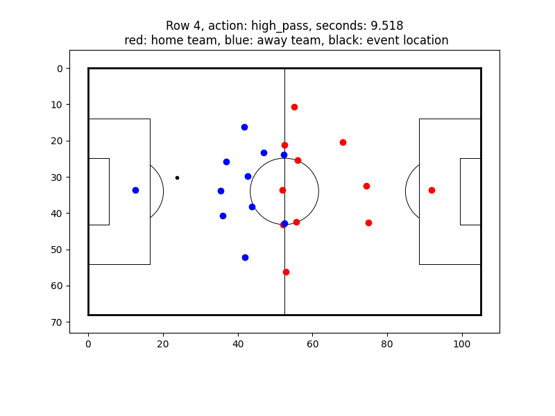

Visualize a row data for the soccer event
==============================================

.. This script downloads, unzips, and preprocesses Wyscout event and match data. The processed data is then split into training, validation, and test sets.
This script Visualize a row of soccer event data in the UEID format, specifically the statsbomb and skillcorner data

Dependencies
------------
* `openstarlab_preprocessing` 
* `tqdm` (optional)

Usage
-----

.. code-block:: python

    from preprocessing import plot_row_soccer
    from tqdm import tqdm
    import os

    #check if the Soccer_event_data class is correctly implemented
    df_path = "path/to/df.csv"
    save_path = "path/to/save"
    
    if not os.path.exists(save_path):
        os.makedirs(save_path)

    for i in tqdm(range(100)):
        plot_row_soccer(df_path,i,save_path)

        print("---------------done-----------------")

Example output
--------------

