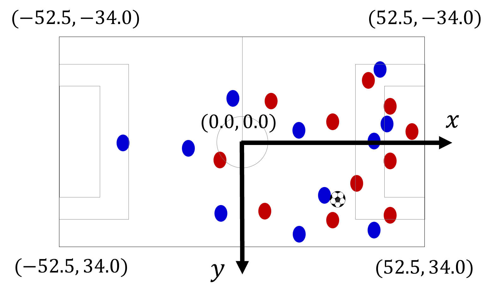

Phase Data
====================================================================

Phase data format is an original design to provide a standardized format for tracking data in football.

**Pitch Coordinates Standardization**:
--------------------------------------

The team attacking towards the positive x-axis is defined as the **left team**, and the team attacking towards the negative x-axis is defined as the **right team**.

**Phase Data Format**:
--------------------------------------

Phase data format includes the following columns:

**Match & Time Info**
    - ``period (int)``: The period of the match (1: 1st Half, 2: 2nd Half, 3: 1st Extra, 4: 2nd Extra).
    - ``inplay_num (int)``: Unique identifier for each in-play sequence. Frames with the same ID belong to a continuous play.
    - ``frame (int)``: Integer representing the frame number throughout the match.
    - ``match_time (int)``: Elapsed time within the current period, represented in milliseconds.

**Ball Data**
    - ``ball_x (float)``: The x-coordinate of the ball.
    - ``ball_y (float)``: The y-coordinate of the ball.

**Team Info**
    - ``left_team_id (int)``: Unique ID of the team attacking the positive x-direction.
    - ``left_team_name (str)``: Name of the team attacking the positive x-direction.
    - ``left_team_side (str)``: Indicates if the left team is the "home" or "away" team.
    - ``right_team_id (int)``: Unique ID of the team attacking the negative x-direction.
    - ``right_team_name (str)``: Name of the team attacking the negative x-direction.
    - ``right_team_side (str)``: Indicates if the right team is the "home" or "away" team.

**Player Data (left_1 to left_11 and right_1 to right_11)**
    - ``{side}_{n}_id (int)``: Unique identifier for the n-th player of the specified side.
    - ``{side}_{n}_name (str)``: Name of the n-th player.
    - ``{side}_{n}_position (str)``: Position acronym of the n-th player (e.g., GK, CB, CM, CF).
    - ``{side}_{n}_x (float)``: The x-coordinate of the n-th player.
    - ``{side}_{n}_y (float)``: The y-coordinate of the n-th player.

.. note::
   Within each team, players are ordered from 1 to 11 based on their positions in the following sequence: **GK (Goalkeeper) → DF (Defenders) → MF (Midfielders) → FW (Forwards)**. For players within the same position group, they are sorted by their IDs.