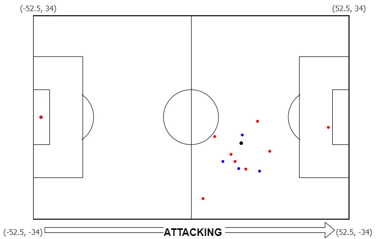

State Action Reward (SAR) Format
====================================================================

The SAR format is designed to provide a standardized format for football event data and tracking data.

Pitch Coordinates Standardization
---------------------------------

SAR Format
----------

The SAR format consists of event data and tracking data.

The event data includes the following columns:
    - ``match_id (int)``: Unique identifier for each match.
    - ``frame_id (int)``: Unique identifier for each frame within a match.
    - ``team (str)``: The team associated with the event.
    - ``team_id (int)``: Unique identifier for each team.
    - ``home_team (int)``: Indicator of whether the team is the home team (1: home, 0: away).
    - ``player_name (str)``: The player associated with the event.
    - ``player_id (int)``: Unique identifier for each player.
    - ``jersey_number (int)``: The player jersey number associated with the event.
    - ``player_role (int)``: The identifier for each player position (1: GK, 2: DF, 3: MF, 4: FW).
    - ``action (str)``: Simplified and standardized description of the event action.
    - ``action_id (int)``: Unique identifier for each event action.
    - ``success (int)``: Indicator of whether the event action was successful (1: success, 0: failure).
    - ``is_goal (int)``: Indicator of whether the event resulted in a goal (1: goal, 0: no goal).
    - ``is_shot (int)``: Indicator of whether the event is a shot (1: shot, 0: no shot).
    - ``is_pass (int)``: Indicator of whether the event is a pass (1: pass, 0: no pass).
    - ``is_dribble (int)``: Indicator of whether the event is a dribble (1: dribble, 0: no dribble).
    - ``is_cross (int)``: Indicator of whether the event is a cross (1: cross, 0: no cross).
    - ``is_through (int)``: Indicator of whether the event is a through pass (1: through, 0: no through).
    - ``is_ball_recovery (int)``: Indicator of whether the event is a ball recovery (1: ball recovery, 0: no ball recovery).
    - ``is_block (int)``: Indicator of whether the event is a block (1: block, 0: no block).
    - ``is_clearance (int)``: Indicator of whether the event is a clearance (1: clearance, 0: no clearance).
    - ``is_interception (int)``: Indicator of whether the event is an interception (1: interception, 0: no interception).
    - ``Period (int)``: The period of the match (1: 1st half, 2: 2nd half, etc.).
    - ``seconds (float)``: The total seconds elapsed since the start of the match, adjusted for different periods.
    - ``start_x (float)``: The x-coordinate of the player location when the event starts (scaled).
    - ``start_y (float)``: The y-coordinate of the player location when the event starts (scaled).
    - ``ball_x (float)``: The x-coordinate of the ball location when the event starts (scaled).
    - ``ball_y (float)``: The y-coordinate of the ball location when the event starts (scaled).
    - ``ball_touch (int)``: Indicator for whether the event is an in-play ball touch (1: valid touch, 0: ball out, foul, or other non-play state).
    - ``series_num (int)``: Sequential number of the in-play sequence of the match.
    - ``history_num (int)``: Chronological history number of the play in the match.
    - ``attack_history_num (int)``: Number for a single attacking sequence.
    - ``attack_start_num (int)``: First history number within the same ``attack_history_num``.
    - ``attack_end_num (int)``: Last history number within the same ``attack_history_num``.

The tracking data includes the following columns:
    - ``match_id (int)``: Unique identifier for each match.
    - ``frame_id (int)``: Unique identifier for each frame within a match.
    - ``home_team (int)``: Indicator of whether the team is the home team (1: home, 0: away).
    - ``jersey_number (int)``: The player jersey number associated with the event.
    - ``x (float)``: The x-coordinate of the player location scaled by the field size.
    - ``y (float)``: The y-coordinate of the player location scaled by the field size.

SAR-to-RL Dataset Conversion (DQN / QMIX)
-----------------------------------------

This section describes a SAR-to-RL dataset conversion step that formats SAR outputs
(``events.jsonl``) into tensors used by DQN and QMIX training. This is a preprocessing
and data-format conversion step, not a training algorithm.

The conversion logic is implemented in ``soccer_sar_to_rl_dataset.py``.

This produces a single shared multi-agent dataset with:
    - ``observation``: ``(B, T, N, O)``, where ``B`` is batch size, ``T`` is sequence length, ``N`` is the number of agents, and ``O`` is the observation dimension. By default, ``N=10`` attackers.
    - ``action``: ``(B, T, N)`` discrete action ids. The default action vocabulary size is ``16`` with ``PAD=15``.
    - ``reward``: ``(B, T)`` team-level reward for each timestep.
    - ``done``: ``(B, T)`` terminal flag for each timestep.
    - ``mask``: ``(B, T)`` valid-timestep mask used for padded sequences.
    - ``onball_mask``: ``(B, T, N)`` mask used for masking unavailable actions.

You can run SAR2RL through the same entry point as SAR:

.. code-block:: python

    from preprocessing import SAR_data

    data_path = "/path/to/data_folder/"
    config_path = "/path/to/preprocess_config.json"
    state_def = "PVS"

    Soccer_SAR_data(
        data_provider='datastadium',
        state_def=state_def,
        data_path=data_path,
        config_path=config_path,
        preprocess_method='SAR2RL'
    ).preprocess_data()

Examples for Standardizing Multiple Matches
-------------------------------------------

Refer to the data provider pages to convert between single-file and multiple-file preprocessing.

Example of the SAR format for DataStadium::

    import pandas as pd
    from preprocessing import SAR_data

    datastadium_path = "/path/to/data_folder/"
    config_path = "/path/to/preprocess_config.json"

    Soccer_SAR_data(
        data_provider='datastadium',
        state_def="PVS",
        data_path=datastadium_path,
        config_path=config_path,
        preprocess_method="SAR"
    ).preprocess_data()

Example of the SAR format for FIFA World Cup 2022::

    import pandas as pd
    from preprocessing import SAR_data

    fifawc_path = "/path/to/data_folder/"
    config_path = "/path/to/preprocess_config.json"

    Soccer_SAR_data(
        data_provider='fifawc',
        state_def="PVS",
        data_path=fifawc_path,
        config_path=config_path,
        preprocess_method="SAR"
    ).preprocess_data()

Example of the SAR format for StatsBomb and SkillCorner::

    import pandas as pd
    from preprocessing import SAR_data

    data_path = '/path/to/statsbomb_skillcorner'
    config_path = '/path/to/preprocess_config.json'
    statsbomb_skillcorner_match_id = '/path/to/statsbomb_skillcorner_match_id.json'

    Soccer_SAR_data(
        data_provider='statsbomb_skillcorner',
        state_def="PVS",
        data_path=data_path,
        config_path=config_path,
        statsbomb_skillcorner_match_id=statsbomb_skillcorner_match_id,
        preprocess_method="SAR"
    ).preprocess_data()
