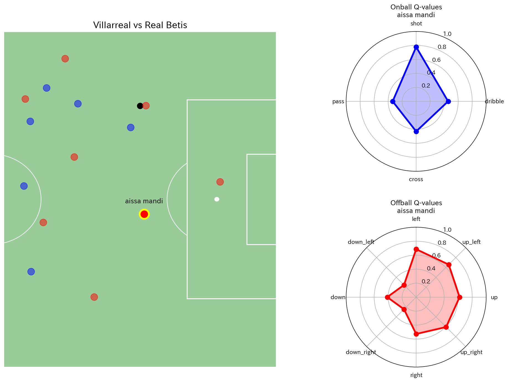

Application of the SAR Model in Soccer
========================================
This section demonstrates applications of the SAR Model in soccer.

Q-values and Location Visualization
------------------------------------------------------------------------------

The following code snippet shows how to use the `SAR_Model` class to plot a heat map of the next event location based on model predictions.

.. code-block:: python

    from .soccer.main_class_soccer.main import rlearn_model_soccer
    import os
    
    # Set path and experiment name for visualize data
    model_name = 'exp_config'
    checkpoint_path = os.getcwd()+'/rlearn/sports/output/sarsa_attacker/test/checkpoints/epoch=1-step=2.ckpt'

    # Visualize
    RLearn_Model().visualize_data(
        model_name=model_name,
        checkpoint_path=checkpoint_path,
        match_id='2022100106',
        sequence_id=0,
    )

The generated image will show the predicted Q-values based on reinforcement learning.

This visualization helps identify potential areas for the next event, making it easier to analyze patterns and trends in soccer gameplay.